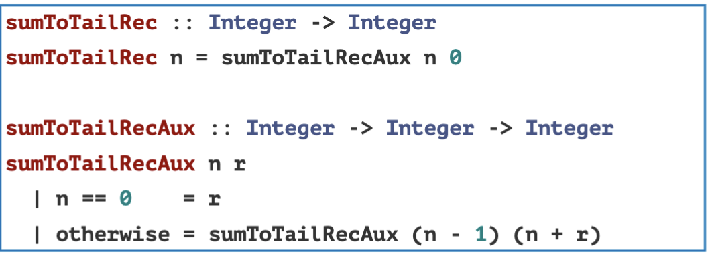

# Pattern Matching
- Specifies patterns to which the data should conform and deconstruct
- When defining functions in haskell we can create seperate functisons

### Example of Pattern Matching
A function for logical AND

```
myAnd :: Bool -> Bool
myAnd True b = b
myAnd False _ = False
```

If the first value is true the returned value is b.
If the first value is false the returned value does not even need to look at the second input. It will always return false

### Pattern matching on lists
Common pattern to deconstruct a list is by head and tail.

Code template
```
func [] = ...
func (x:xs) = ... func xs ...
```

To count length of a list recursively.
```
myLength :: [a] -> input
myLength [] = 0
myLength (_:xs) = 1 + myLength xs
```

[] matches an empty list

[x] matches a Singleton list

(x:xs) matches a list with at least one element

(x:y:xs) matches a list with at least 2 elements

and many more 

### Non-Exhaustive patterns
- If we cannot match to any pattern, Haskell with just throw an exception
"Non-Exhaustive Patterns"

# If Then Else:
```
pos :: Int -> String
pos x = if x > 0
        then "pos"
        else "non pos"
```


### Case Expressions

```
describeList :: [a] -> String
describeList ls = "The List is " ++ case ls of 
    [] -> "empty"
    [_] -> "a singleton list"
    (x:xs) -> "A longer list"
```

### List Comprehensions
- Generators - Creates source values in the comprehension
- Generator uses the drawn from operator with a list on the right like: <-

Use it to apply a whole list to a function
```
[x^2 | x<- [1,2,3,4,5]]
[1,4,9,16,25]

[succ c | c <- "abcd"]
```

Can do multiple Generators

- Guards - to filter values produced by Generators
- Guard is a predicate (Boolean expression)
if Guard evaluates true under a value the value is retained
if guard evaluates to false the value is discarded
```
[x^2 | x<- [1,2,3,4,5]]
[1,4,9,16,25]

[x^2 | x<- [1,2,3,4,5], even x]
[4, 16]
```


The .. operator can be used to build a list/sequence
[1..5] = [1,2,3,4,5]
[3,6..20] = [3,6,9,12,15,18]
['a'..'g'] = you get the point


### Let and Where
Used for code readability


### Let Expressions
- Can be used anywere expressions are allowed 
- The "Let ... in..." is an expression

let x = 9 in x+1
10

it can be used to simplify longer definitions

```
cylinder :: Double -> Double -> Double
cylinder :: r h =
    let sideArea = 2 * pi * r * h
        topArea = pi * r * r 
    in sideArea + 2 * topArea
```

INDENTATION MATTERS
FROM AFTER LET ALL EXPRESSIONS NEED TO BE ALIGNED IN THE SAME COLUMN


### Where Clauses
Where clause is bound to surrounding syntactic construct like the pattern matching line of a function definition

```
cylcinder :: Double -> Double -> Double
cylinder r h = sideArea + 2 * topArea
    where sideArea = 2 * pi * r * h
          topArea = pi * r * h
```

### Let vs Where
- Let allows us to bind variables everywhere (we can make as many variables as we want) (Let becomes a value at the end)
- Where clauses can only bind variables at the end of a function
- Variables in let are local they do not span Guards
- Variables in where are visible to the entire function
- Where puts the definitions at the end formula and then values
- let defines the values and then gives the formula
- in the case of guards ie "|" you almost always want to use where because where makes it so everything in the function knows the values whereas with let it does not see the variables globally.

# Recursion!!!

- Haskell does not really have regular loops
- it has recursion instead
- Language is turing complete 

Haskell needs a BASE CASE where the result is straight forward

Recursive Case finds a subproblem calls the same function to solve the subproblem use the sub-result to create the result for the bigger problem

Example: argument n decreases to n-1 or n/2. Base case is 0 or 1

Example: argument (x:xs) becomes xs. Base case is [] or [x]

## Example: Maximum function!
- Start with considering the type 
```
maximum :: Ord a => [a] -> a
maximum [] = error "Empty List"
maximum [x] = x
maximum (x:xs) = max x (maximum xs)
```

## Example Quick Sort
```
quicksort :: Ord a => [a] -> [a]
quicksport [] = []
quicksort (x:xs) = smaller ++ [x] ++ larger
    where smaller = quicksort [a | a <- xs, a<=x]
          larger = quicksort [a | a <- xs, a>x]
```

 


## Example Replicate:

Replicate from prelude, takes an int and a value and returns a list that has the specified number of repetitions of the value. 

What is the type of replicate?

```
myReplicate :: Int -> a -> [a]
myReplicate n v
    | n<=0 = []
    | otherwise = v : myReplicate (n-1) v 
```


## Example Take:
take from prelude takes an int n and a list and returns the first n elements of the list

what is the toye of take?
Int -> [a] -> [a]

```
myTake :: Int -> [a] -> [a]
myTake n _
    | n<= 0 = []
myTake _ [] = []
myTake n (x:xs) = x : myTake (n-1) xs
```

## Example Zip:

Takes two lists and zips them together. It truncates the longer list to match the length of the shorter one

for example zip [1,2,3] [7,8] returns [(1,7), (2,8)]

What is the type of zip?

[a]->[b]->[(a,b)]


# Recursion with Auxiliary Functions
helper functions

## Example: findFirst
- Takes a value V and a list as input and returns the position of the first occurence of V in the list if V does not exist in the list it returns -1

```
findFirst :: Eq a => a -> [a] -> Int
findFirst v xs = findFirstAux 0 v xs 
    where
        findFirstAux :: Eq a => Int -> a -> [a] -> Int
        findFirstAux _ _ [] = -1
        findFirstAux i v (x:xs)
            | v == x    = i
            | otherwise = findFirstAux (i+1) v xs

```

# Mutual Recursion
- Functions can be defined using mutual recursion where 2 or more functions are defined recursively in terms of each other

Example: Even and Odd functions

```
myEven :: Int -> Bool
myEven 0 = True
myEven n = myOdd (n-1)

myOdd :: Int -> Bool
myOdd 0 = False
myOdd n = myEven (n-1)
```

# Efficiency of Recursion
- One may complain that a recursive function is less efficient than the iterative version because the recursive need to maintain a large call stack.
- 


## Tail Recursion
- Tail Recursive if a resursive call is the last thing executed by the function

## Example: SumToTailRec
- computs the sum of integers from 0 to N 




